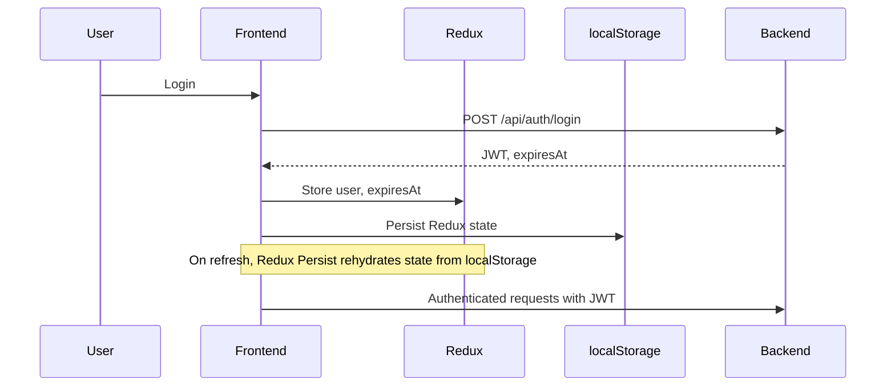

# Esports Management

A platform for professional management of esports teams, tournaments, and players.

---

## Table of Contents

- [Project Overview](#project-overview)
- [Features](#features)
- [Tech Stack](#tech-stack)
- [Requirements](#requirements)
- [Getting Started](#getting-started)
- [Code Style](#code-style)
- [Testing and Code Quality](#testing-and-code-quality)
- [Docker Configuration](#docker-configuration)
- [Architecture](#architecture)
- [Project Structure](#project-structure)
- [Data Model](#data-model)
- [Commands](#commands)
- [Quality Control](#quality-control)
- [Security](#security)
- [Deployment](#deployment)
- [Environment Variables](#environment-variables)
- [Naming Convention](#naming-convention)
- [Development Workflow](#development-workflow)
- [API Response Standard](#api-response-standard)
- [Contributing](#contributing)
- [License](#license)
- [Contact](#contact)

---

## Project Overview

Gestion Esports is a full-stack application to manage esports teams, tournaments, and users.  
It follows **Clean/Hexagonal Architecture** principles, ensuring separation of concerns and testability.

### Infrastructure and Deployment

We use a container-based approach with Docker to ensure consistent environments:

- **Frontend**: Node.js container running the React app
- **Backend**: Node.js container running the Express API
- **Database**: MySQL container for persistence
- **Nginx**: As reverse proxy and to serve the compiled frontend

The entire stack can be started with a single command using Docker Compose, both for development and production.

### Developer Workflow

As a new developer, these are the main steps to get started:

1. **Initial setup**: Clone the repository and run `npm install` and `npm run bootstrap`
2. **Development environment**: Start the environment with `npm run docker-start` or `make dev`
3. **Development**:
   - Frontend (without Docker): `cd packages/frontend && npm start`
   - Backend (without Docker): `cd packages/backend && npm start`
4. **Commits**: Use `npm run commit` or `make commit` to follow project conventions
5. **CI/CD**: Every push to main runs automated tests before deployment

### Technologies and Patterns

The platform is built with a modern tech stack:

- **CQRS Pattern**: Separation of read and write operations
- **State Architecture**: Redux with slice pattern
- **RESTful API**: Designed following Richardson maturity model
- **SOLID Principles**: Guide the design of all components
- **DDD (Domain-Driven Design)**: Focus on domain modeling

---

## Features

- User authentication (JWT, session timeout, auto-logout)
- Role-based access control
- Team and tournament management
- Responsive UI with accessibility (WCAG2) best practices
- Toast notifications and session timeout modal
- Internationalization (i18n) with `react-i18next`
- Centralized API route management
- Modular Redux state management with persistence (redux-persist)
- Full unit test coverage (Jest)
- Dockerized development environment

---

## Tech Stack

### Frontend

- React 19
- TypeScript
- Redux Toolkit
- React Router v7
- Bootstrap 5.3
- i18next for internationalization
- Axios for HTTP requests
- Webpack 5
- Jest and Testing Library for unit tests
- Cypress for E2E tests

### Backend

- Node.js
- Express
- Prisma ORM
  - Type-safe generated client
  - Prisma Studio for data visualization
  - Automated migrations
- MySQL
- JWT for authentication

### DevOps

- Docker and Docker Compose
- Nginx as web server and reverse proxy
- GitHub Actions for CI/CD

---

## Requirements

- Node.js 18+
- NPM 8+
- Docker and Docker Compose (for deployment)
- MySQL (or use the dockerized version)

---

## Getting Started

### Prerequisites

- Node.js (v18+)
- Docker & Docker Compose
- Yarn or npm

### Installation

```bash
git clone https://github.com/your-org/gestion-esports.git
cd gestion-esports
yarn install
```

### Running the App

**With Docker (recommended):**

```bash
docker-compose up --build
```

**Locally:**

```bash
# Start backend
cd packages/backend
yarn dev

# Start frontend
cd packages/frontend
yarn dev
```

---

## Code Style

This project follows strict code conventions to ensure readability, maintainability, and quality. Key practices include:

### Code Style (Prettier)

We use Prettier with the following configuration:

- Semicolons at the end of statements
- 2-space indentation
- Max line length: 100 characters
- Single quotes
- Trailing commas in multiline arrays and objects

**Correct example:**

```typescript
const getUserData = async (userId: string): Promise<UserProfile | null> => {
  try {
    const response = await api.get(`/users/${userId}`);
    return {
      id: response.data.id,
      name: response.data.name,
      role: response.data.role,
    };
  } catch (error) {
    logger.error('Error fetching user data', { userId, error });
    return null;
  }
};
```

### ESLint Rules

Some key rules:

- Organize imports by groups and alphabetically
- Strict typing: do not use explicit `any`
- Handle unused variables
- React-specific rules

**Example of import organization:**

```typescript
// External imports first (alphabetically)
import axios from 'axios';
import { useEffect, useState } from 'react';
import { useDispatch } from 'react-redux';

// Then internal imports (separated by a blank line)
import { fetchUserData } from '../api/userApi';
import { Button } from '../components/common';
import { AppDispatch } from '../store';
```

### Clean Code Principles

#### DRY (Don't Repeat Yourself)

```typescript
// ❌ Bad: repeated code
function validateEmail(email: string): boolean {
  const emailRegex = /^[^\s@]+@[^\s@]+\.[^\s@]+$/;
  return emailRegex.test(email);
}

function validateSignupForm(data: SignupFormData): boolean {
  const emailRegex = /^[^\s@]+@[^\s@]+\.[^\s@]+$/;
  if (!emailRegex.test(data.email)) return false;
  // More validations...
  return true;
}

// ✅ Good: reuse
function validateEmail(email: string): boolean {
  const emailRegex = /^[^\s@]+@[^\s@]+\.[^\s@]+$/;
  return emailRegex.test(email);
}

function validateSignupForm(data: SignupFormData): boolean {
  if (!validateEmail(data.email)) return false;
  // More validations...
  return true;
}
```

#### YAGNI (You Aren't Gonna Need It)

Avoid implementing features "just in case". Every feature must be justified by current requirements.

#### SOLID

**Single Responsibility Principle (SRP):**

```typescript
// ❌ Bad: class with multiple responsibilities
class UserManager {
  getUserProfile(id: string): UserProfile {
    /* ... */
  }
  renderUserCard(user: UserProfile): JSX.Element {
    /* ... */
  }
  updateUserData(id: string, data: UserUpdateData): Promise<void> {
    /* ... */
  }
}

// ✅ Good: separation of responsibilities
class UserService {
  getUserProfile(id: string): UserProfile {
    /* ... */
  }
  updateUserData(id: string, data: UserUpdateData): Promise<void> {
    /* ... */
  }
}

function UserCard({ user }: { user: UserProfile }): JSX.Element {
  // Component rendering
}
```

---

## Data Persistence Strategy

### Frontend

- **Redux Persist:**  
  The application uses [Redux Persist](https://github.com/rt2zz/redux-persist) to automatically save and rehydrate the Redux state across browser reloads.
  - **Storage:** By default, data is persisted in `localStorage`.
  - **What is persisted:** Only selected slices of the Redux state (e.g., authentication/session) are persisted, following best security practices.
  - **Session Expiry:** Session expiration is managed by storing the absolute expiration date (`expiresAt`) in both Redux and `localStorage`. On browser refresh, the middleware rehydrates and recalculates session state based on this value.
  - **Security:** Sensitive data (like tokens) is never persisted in plain text or outside secure storage.

### Backend

- **Database:**  
  The backend uses **MariaDB** as the primary data store, managed via **Prisma ORM**.
  - **Migrations:** All schema changes are versioned and managed with Prisma Migrate.
  - **Entities:** User, Team, Tournament, and other domain entities are mapped as Prisma models.
  - **Repository Pattern:** Data access is abstracted using repositories, following Clean Architecture principles.
  - **Session Management:** Authentication is stateless (JWT), but session expiration is enforced both client- and server-side.

### Example: Session Persistence Flow



---

## Testing and Code Quality

This project follows a rigorous approach to code quality through automated testing:

### Coverage Requirements

We maintain a **minimum of 90% coverage** for:

- Statements
- Branches
- Functions
- Lines

These thresholds are automatically checked on every pre-commit and in the CI pipeline.

### Testing Strategy

#### Frontend

- **Unit Tests**: For isolated components, custom hooks, and utilities
- **Integration Tests**: For flows involving multiple components
- **E2E Tests**: With Cypress for full user flows

#### Backend

- **Unit Tests**: For isolated functions and services
- **Integration Tests**: For APIs and endpoints
- **Repository Tests**: For validating database interactions

### Best Practices

- Follow the AAA pattern (Arrange-Act-Assert)
- Use mocks for external dependencies
- Descriptive tests that serve as documentation
- Focus on behaviors, not implementations

**Example unit test:**

```typescript
describe('PasswordStrength', () => {
  it('should show weak strength when the password is less than 8 characters', () => {
    // Arrange
    render(<PasswordStrength password="abc123" />);

    // Act
    const strengthIndicator = screen.getByTestId('strength-indicator');

    // Assert
    expect(strengthIndicator).toHaveTextContent('Weak');
    expect(strengthIndicator).toHaveClass('weak');
  });
});
```

### Test Profiling for Optimization

To identify bottlenecks in test execution and optimize performance, you can profile using Node.js and Jest's built-in tools.

**Steps:**

1. **Generate the profile file:**
   Run Jest with the `--prof` Node.js flag and the `-i` (or `--runInBand`) Jest flag to run tests sequentially.

   From `packages/frontend`:

   ```bash
   node --prof ../../node_modules/jest-cli/bin/jest.js -i src/ui/pages/YourSuite/__tests__/index.test.tsx
   ```

   Or, more generally:

   ```bash
   node --prof ./node_modules/.bin/jest -i <test_file_path>
   ```

   This will generate a `.log` file in the current directory (e.g., `isolate-0x...-v8.log`).

2. **Process the profile file:**
   Use Node.js to process the `.log` file and get a readable report:

   ```bash
   node --prof-process <generated_log_file.log> > profile_output.txt
   ```

3. **Analyze `profile_output.txt`:**
   Open the file and look for:
   - `[Summary]:` for an overview.
   - `[Bottom up (heavy) profile]:` for the most time-consuming functions.

This process helps you detect slow tests and the specific operations causing slowness.

### Quick Guide: Snapshots with Jest

- **Do not update snapshots automatically on every test or before every push.**
- Run tests normally (`npm test`).
- If a snapshot fails, Jest will show the diff.
- Review the visual/structural change before updating the snapshot.
- If the change is intentional and correct, update snapshots with:

  ```bash
  npm run update:snapshots
  ```

- Commit `.snap` files only if the change is legitimate and reviewed.
- Orphaned snapshots are automatically removed when updating.

**Frontend script:**

```json
"update:snapshots": "jest -u"
```

---

## Docker Configuration

This project is fully dockerized for consistent development and production environments. The structure and operation of the containers are detailed below.

### Docker File Structure

```
gestion-esports/
├── docker/
│ ├── docker-compose.yml
│ ├── docker-compose.override.yml
│ ├── docker-compose.prod.yml
│ ├── nginx/
│ │ ├── Dockerfile
│ │ ├── nginx.conf
│ │ └── default.conf
│ ├── db/
│ │ └── init/
│ │ └── db_schema.sql
│ ├── phpmyadmin/
│ ├── ssl/
│ └── volumes/
│ └── mariadb_data/
```

Principles followed:

- **Service-specific files**: Dockerfiles in their respective packages
- **Orchestration config**: docker-compose and complementary configs in `/docker`
- **Data persistence**: Centralized volumes in `/docker/volumes`
- **Security**: SSL certificates in `/docker/ssl`
- **DB initialization**: SQL scripts in `/docker/db/init`

### Docker Compose Files

- `docker/docker-compose.yml`: Base config for main services (db, backend, phpmyadmin)
- `docker/docker-compose.override.yml`: Development-specific config (hot-reloading, volumes, etc.)
- `docker/docker-compose.prod.yml`: Production-specific config (optimization, SSL, etc.)

### Container Structure

1. **Frontend (Node.js)**

   - Serves React app in development
   - Builds static assets for production
   - Mounted volumes for real-time development

2. **Backend (Node.js)**

   - REST API with Express
   - Connects to DB via Prisma
   - Mounted volumes for real-time development

3. **Database (MariaDB)**

   - Persistent storage via Docker volumes in `docker/volumes/mariadb_data`
   - Auto-initialization via SQL scripts in `docker/db/init`
   - User, password, and initial DB config
   - Exposed port for external tools

4. **PHPMyAdmin**

   - Web interface for DB management
   - Accessible via Nginx proxy

5. **Nginx**
   - Web server as single entry point
   - SSL certificates in `docker/ssl`
   - Reverse proxy for backend and PHPMyAdmin
   - Serves static frontend files in production

### Development vs. Production

#### Development

```bash
npm run docker-start
# or
make dev
```

- Frontend runs webpack-dev-server with hot-reloading
- Code changes are reflected immediately
- All service logs shown in console
- Nginx serves everything over HTTP for easier development

#### Production

```bash
npm run docker-prod
# or
make prod
```

- Frontend is built as static assets
- Nginx serves static frontend files
- SSL enabled with HTTP to HTTPS redirection
- Performance optimizations in all containers
- Hardened security config

### Volumes and Persistence

- `docker/volumes/mariadb_data`: Stores MySQL/MariaDB database
- Source code volumes: Enable real-time development
- Config volumes: Allow config changes without rebuilding

All persistent data is centralized in `docker/volumes` for better organization and backup management.

### Service Communication

Containers communicate via Docker's internal network:

- Backend connects to DB using `mysql://user:password@db:3306/dbname`
- Frontend communicates with backend via Nginx
- Nginx routes `/api` requests to backend

---

## Architecture

This project is structured as a monorepo with hexagonal architecture, using:

- Frontend: React 19 with TypeScript
- Backend: Node.js with Express
- Database: MySQL
- ORM: Prisma
- Monorepo management: Lerna
- Containers: Docker

---

## Project Structure

```
gestion-esports/
├── docker/
├── packages/
│ ├── frontend/
│ │ ├── src/
│ │ │ ├── domain/
│ │ │ ├── application/
│ │ │ ├── infrastructure/
│ │ │ ├── ui/
│ │ │ ├── shared/
│ │ │ └── i18n/
│ │ ├── Dockerfile
│ └── backend/
│ ├── src/
│ │ ├── domain/
│ │ ├── application/
│ │ ├── infrastructure/
│ │ └── shared/
│ ├── prisma/
│ ├── Dockerfile
└── .husky/
```

## Data Model

The project uses Prisma as ORM with MySQL. Main models:

- **User**: User management with roles and authentication
- **Team**: Esports team management

The full database schema is in the SQL initialization scripts in `docker/db/init/`.

## Commands

```bash
# Install dependencies in all packages
npm run bootstrap

# Start frontend in development mode
npm run start:frontend

# Start backend in development mode
npm run start:backend

# Build all packages
npm run build

# Run tests in all packages
npm run test

# Run linter in all packages
npm run lint

# Start Docker environment in development
npm run docker-start
# or
make dev

# Start Docker environment in production
npm run docker-prod
# or
make prod

# Stop and remove Docker containers
npm run docker-down
# or
make clean

# Create a conventional commit
npm run commit
# or
make commit
```

### Prisma Scripts (Backend)

To manage the database via Prisma ORM, use the following commands:

```bash
# Generate Prisma client from schema
cd packages/backend && npm run prisma:generate
# or with lerna
npx lerna run --scope=@gestion-esports/backend prisma:generate

# Create and apply migrations in development
cd packages/backend && npm run prisma:migrate
# or with lerna
npx lerna run --scope=@gestion-esports/backend prisma:migrate

# Start Prisma Studio (visual DB interface)
cd packages/backend && npm run prisma:studio
# or with lerna
npx lerna run --scope=@gestion-esports/backend prisma:studio

# Format schema.prisma
cd packages/backend && npm run prisma:format
# or with lerna
npx lerna run --scope=@gestion-esports/backend prisma:format

# Push changes directly to DB without migrations
cd packages/backend && npm run prisma:push
# or with lerna
npx lerna run --scope=@gestion-esports/backend prisma:push
```

---

## Quality Control

### Git Hooks and Standardized Commits

- **Husky**: Manages Git hooks for pre-commit validations
- **Commitizen**: Standardized commit format following Conventional Commits
- **Lint-staged**: Runs linters and formatters only on changed files

The pre-commit process includes:

1. Running lint-staged for changed files
2. Running automated tests
3. Checking code coverage (minimum 80%)

To create a new commit, use `npm run commit` instead of `git commit` to follow the conventional format.

---

## Security

- reCAPTCHA implementation for forms
- Password strength analysis with zxcvbn
- HTTPS with SSL certificates stored in `docker/ssl`

---

## Deployment

The project is configured for deployment with Docker:

1. Make sure you have Docker and Docker Compose installed
2. Run `npm run docker-prod` or `make prod` to start in production mode
3. The app will be available at:
   - Frontend: https://localhost
   - Backend API: https://localhost/api
   - PhpMyAdmin: https://localhost/phpmyadmin

### Accessing PHPMyAdmin

To manage the database, the project includes PHPMyAdmin accessible at:

```
https://localhost/phpmyadmin
```

Credentials:

- **User**: root
- **Password**: rootpassword

Or you can also use the normal user:

- **User**: admin
- **Password**: a/dmi.n45\_&ssHG$ass

PHPMyAdmin is configured with:

- HTTPS-only access
- Session timeout (5 minutes)
- Protections against dangerous operations
- Interface in English

### Redirects and Access URLs

The project uses Nginx as a reverse proxy to route traffic to different services. Here’s how to access each service from the host and from within containers:

#### Access from host (browser/local machine)

| Service     | URL/Port                        | Description                        |
| ----------- | ------------------------------- | ---------------------------------- |
| Frontend    | `https://localhost/`            | Application user interface         |
| Backend API | `https://localhost/api/`        | REST API for backend operations    |
| PHPMyAdmin  | `https://localhost/phpmyadmin/` | Database management                |
| WebSockets  | `https://localhost/ws`          | WebSocket connection for dev (HMR) |
| MariaDB     | `localhost:3306`                | Direct DB access                   |

#### Access from Frontend container

| Target     | URL/Command                              | Description                   |
| ---------- | ---------------------------------------- | ----------------------------- |
| Backend    | `http://backend:3000/api/`               | API communication             |
| MariaDB    | `mysql -h db -uadmin -p gestion_esports` | Direct DB access              |
| PHPMyAdmin | `curl http://phpmyadmin:80/`             | PHPMyAdmin access (HTTP only) |

#### Access from Backend container

| Target   | URL/Config                                       | Description                     |
| -------- | ------------------------------------------------ | ------------------------------- |
| MariaDB  | `mysql://admin:password@db:3306/gestion_esports` | DB connection                   |
| Frontend | `http://frontend:3000`                           | Frontend access (rarely needed) |

#### Access from PHPMyAdmin container

| Target  | Config        | Description                        |
| ------- | ------------- | ---------------------------------- |
| MariaDB | `PMA_HOST=db` | Automatic config in docker-compose |

#### Internal network names (Docker DNS)

All containers can communicate using their service names:

- `frontend` → Frontend service (React)
- `backend` → API service (Node.js/Express)
- `phpmyadmin` → DB admin service
- `db` → Database service (MariaDB)
- `nginx` → Reverse proxy

#### Nginx redirect config

```nginx
# Frontend (React)
location / {
  proxy_pass http://frontend:3000;
}

# WebSockets for Hot Module Replacement
location /ws {
  proxy_pass http://frontend:3000;
  proxy_http_version 1.1;
  proxy_set_header Upgrade $http_upgrade;
  proxy_set_header Connection 'upgrade';
}

# Backend API (Node.js)
location /api/ {
  proxy_pass http://backend:3000/api/;
}

# PHPMyAdmin
location /phpmyadmin/ {
  rewrite ^/phpmyadmin/(.*)$ /$1 break;
  proxy_pass http://phpmyadmin:80/;
}
```

---

## Environment Variables

This project uses `.env` files for different environments. All required variables for each package are documented below:

### Frontend (`packages/frontend`)

| Variable                     | Description                                               | Sensitive |
| ---------------------------- | --------------------------------------------------------- | :-------: |
| REACT_APP_LANG               | Default app language                                      |    No     |
| REACT_APP_AUTH_TOKEN_KEY     | Auth token key name in localStorage                       |    No     |
| REACT_APP_CYPRESS_BASE_URL   | Base URL for Cypress E2E tests                            |    No     |
| REACT_APP_NODE_ENV           | Execution environment (`development`, `production`, etc.) |    No     |
| REACT_APP_API_TIMEOUT        | HTTP request timeout (ms)                                 |    No     |
| REACT_APP_API_URL            | Backend API base URL                                      |    No     |
| REACT_APP_ENABLE_ANALYTICS   | Enable/disable analytics                                  |    No     |
| REACT_APP_ENABLE_DEBUG_TOOLS | Enable debug tools                                        |    No     |
| REACT_APP_ENABLE_WEB_VITALS  | Enable performance metrics                                |    No     |
| REACT_APP_PORT               | React dev server port                                     |    No     |
| REACT_APP_RECAPTCHA_SITE_KEY | Google reCAPTCHA public key                               |    No     |
| REACT_APP_WDS_SOCKET_PORT    | Webpack Dev Server (HMR) port                             |    No     |
| REACT_APP_REFRESH_TOKEN_KEY  | Refresh token key name in localStorage                    |    No     |

> **Note:** Never include secrets or passwords in the frontend. All sensitive variables must be backend-only.

### Backend (`packages/backend`)

| Variable       | Description                                               | Sensitive |
| -------------- | --------------------------------------------------------- | :-------: |
| COOKIE_MAX_AGE | Cookie lifetime (ms)                                      |    No     |
| COOKIE_SECRET  | Cookie secret                                             |    Yes    |
| CORS_ORIGIN    | Allowed CORS origin                                       |    No     |
| DATABASE_URL   | Database connection URL                                   |    Yes    |
| FRONTEND_URL   | Public frontend URL                                       |    No     |
| JWT_EXPIRES_IN | JWT expiration time                                       |    No     |
| JWT_SECRET     | JWT signing secret                                        |    Yes    |
| MAIL_FROM      | Email sender                                              |    No     |
| MAIL_HOST      | SMTP server host                                          |    Yes    |
| MAIL_PASSWORD  | SMTP password                                             |    Yes    |
| MAIL_PORT      | SMTP server port                                          |    No     |
| MAIL_USER      | SMTP user                                                 |    Yes    |
| MYSQL_DATABASE | Database name                                             |    Yes    |
| MYSQL_HOST     | MySQL server host                                         |    Yes    |
| MYSQL_PASSWORD | MySQL password                                            |    Yes    |
| MYSQL_USER     | MySQL user                                                |    Yes    |
| NODE_ENV       | Execution environment (`development`, `production`, etc.) |    No     |
| PORT           | Backend port                                              |    No     |
| SESSION_SECRET | Session secret                                            |    Yes    |

> **Sensitive variables:** Never include real values in the repo. Set them directly in Heroku or your secure production environment.

---

## Naming Convention

### For UI Components

- **Component directories:** Use **PascalCase** for folders containing React components.
  - Example: `Button/`, `UserProfile/`, `LoginForm/`
- **Component files:** Use **PascalCase** for main component files.
  - Example: `Button.tsx`, `UserProfile.tsx`
- **Grouping folders:** If a folder groups related components (e.g., forms), also use PascalCase: `Forms/`

> This convention keeps code consistent and easy to navigate for the whole team.

### For Pages and Layouts

- **Page directories:** All directories must end with `Page`.
  - Example: `LoginPage/`, `RegisterPage/`, `DashboardPage/`
- **Layout directories:** All directories must end with `Layout`.
  - Example: `MainLayout/`, `PublicLayout/`

> This convention makes navigation and maintenance easier, and helps distinguish between pages, layouts, and other components.

### File Names

- **React components:** PascalCase (`LoginForm.tsx`, `UserProfileCard.tsx`)
- **Custom hooks:** Prefix `use` and camelCase (`useAuth.ts`, `useToast.ts`)
- **Utilities/helpers:** camelCase (`formatDate.ts`, `parseJwt.ts`)

### Exporting

- **Main components:** Default export
- **Utilities, hooks, and constants:** Named exports

### Tests

- Place tests in a `__tests__` subfolder next to the component/page
- Name test files the same as the component: `LoginForm.test.tsx`

### Imports

- Use absolute imports with aliases (`@ui/components/Button`)

### Variable and Function Names

- **Variables/functions:** camelCase (`userProfile`, `getUserData`)
- **Classes/types:** PascalCase (`User`, `UserProfile`)
- **Constants:** UPPER_SNAKE_CASE (`API_URL`)

### Error Handling

- Catch and handle errors in promises/async
- Use clear, translatable error messages (i18n)

### Styles

- If using CSS Modules: name the file the same as the component (`LoginForm.module.css`)
- If using styled-components, group styles in the same file or in `styles/`

### Folder structure

- Keep the hexagonal/clean structure: `domain/`, `application/`, `infrastructure/`, `ui/`, `shared/`
- Do not mix domain logic with presentation

### Documentation

- Add JSDoc comments to functions, classes, and public methods
- Document component props and data types

### Commits

- Use Conventional Commits (`feat:`, `fix:`, `refactor:`, `docs:`, etc.) for commit messages

> Following these conventions helps keep code professional, scalable, and easy to understand for the whole team.

---

## API Response Standard

All API responses follow a uniform structure for easy consumption and error handling in the frontend.

### General Structure

#### Success (success: true, status 2xx)

```json
{
  "data": { ... },      // Object, array, or null with the operation payload
  "status": 200,        // HTTP 2xx code (usually 200)
  "success": true       // Boolean: true if the operation was successful
}
```

#### Business error (success: false, status 2xx)

```json
{
  "data": null, // May include business error details
  "status": 200, // HTTP 2xx code (usually 200)
  "success": false, // Boolean: false if the logical operation failed
  "message": "Error message", // Descriptive error string (optional)
  "code": "BUSINESS_ERROR" // Programmatic error code (optional)
}
```

#### Transport layer error (success: false, status 4xx/5xx)

```json
{
  "data": null, // May include error details
  "status": 400, // HTTP 4xx/5xx code
  "success": false, // Boolean: false
  "message": "Error message", // Descriptive error string (optional)
  "code": "TRANSPORT_ERROR" // Programmatic error code (optional)
}
```

#### Unknown error (success: false, status 500, code UNKNOWN_ERROR)

```json
{
  "success": false,
  "status": 500,
  "message": "An unknown error occurred",
  "code": "UNKNOWN_ERROR"
}
```

### Field Details

- **data**: Object, array, or null. Contains the result or error details.
- **status**: Number. Actual HTTP response code.
- **success**: Boolean. Indicates if the operation was successful (`true`) or failed (`false`).
- **message**: String (optional). Descriptive error message, for user display.
- **code**: String (optional). Programmatic error code, for frontend logic.

### Notes:

- The frontend should always check the `success` field to determine logic flow.
- The `code` field allows programmatic logic (e.g., show specific messages by error type).
- The `message` field is meant for user-facing, translatable messages.
- The `data` field may be null on errors, or contain additional details (e.g., field validation errors).

---

## Contributing

1. Fork the repository
2. Create a feature branch (`feat/your-feature`)
3. Commit using [Conventional Commits](https://www.conventionalcommits.org/)
4. Open a pull request

### TODO's

- Finish ReCAPTCHA integration
- Finish Login process (after 1st login attempt, show "Password recovery link")
- Password Recovery process
- Sign-up process
- Email verification proccess: send email with link, handle token expirantion, etc
- Improve UX with modern interface, brand logo, etc.
- Improve code coverage up to 90%
- Backend: explore NextJS and SSR

---

## License

[MIT](./LICENSE)

---

## Contact

For questions, suggestions, or contributions, open an issue or contact the maintainers.
